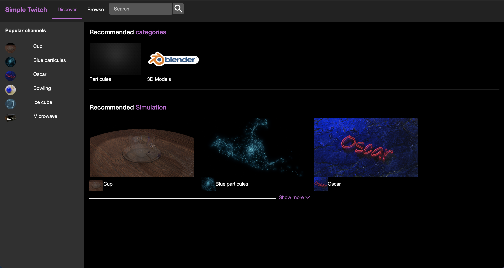
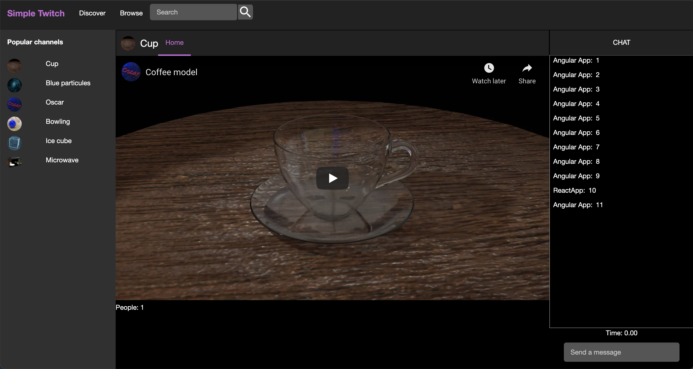

# SimpleTwitch (En desarrollo)

**Web (En desarrollo)**: https://simple-twitch.oscarcatarigutierrez.com/

**Descripción:** Plataforma basaba en canales para mostrar videos y modelos 3D.

**Características**:
* Discover: Lista de recomendaciones (Categorias y canales)
* Browse: Lista de categorias y canales
* Canal: 
    * Contenido: Video de Youtube o modelo 3D
    * Chat: Comentarios
* Backend: 
    * Github: https://github.com/oscarjcg/simple-twitch-backend-laravel

**Entorno de desarrollo**:
* **Sistema operativo:** Windows 10 64 bits
* **Angular:**  12.2
* **Angular CLI:** 8.3.9
* **Node:** 12.11.1
* **bootstrap** 3.4.1

**Docker**:
* Run container with shell
    * `docker compose run --rm -p 3001:3000 personal-web-react bash`
* Inside container install packages and exit
	* `npm install`
	* `exit`
* Run docker compose and it will start npm start (http://localhost:3001)
    * `docker compose up`
* Delete container (not image and node_modules)
    * `docker compose down`
