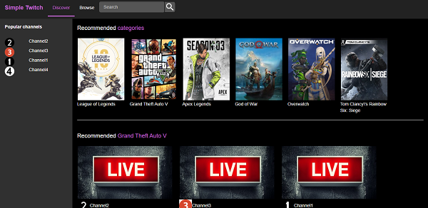
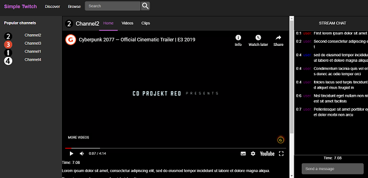

# SimpleTwitch (En desarrollo)

**Web (En desarrollo)**: https://simple-twitch-angular.firebaseapp.com/

**Descripción:** Versión simplificada de [Twitch](https://www.twitch.tv/directory) (Plataforma de live streaming centrada en juegos)

**Características**:
* Discover: Lista de recomendaciones (Categorias y canales)
* Browse: Lista de categorias y canales
* Categoria: Juego 
* Canal: 
    * Video: Video de Youtube
    * Chat: Comentarios 
* Backend: 
    * Github: https://github.com/oscarjcg/backend-simple-twitch

**Entorno de desarrollo**:
* **Sistema operativo:** Windows 10 64 bits
* **Angular:**  8.2.10
* **Angular CLI:** 8.3.9
* **Node:** 12.11.1
* **bootstrap** 3.4.1